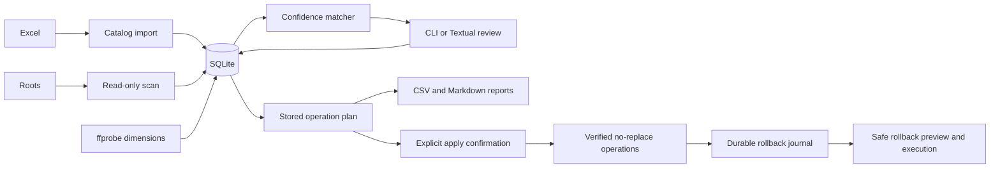

# Architecture

Python package `media_curator` contains ten independently documented functional modules. Typer/Rich and optional Textual call the same synchronous core. SQLite stores catalog rows, inventory, probes, candidates, manual decisions, immutable plan JSON, operation manifests and audit events. The source workbook is read-only.

## Storage and lifecycle

- `catalog`: immutable source fields serialized alongside raw Excel columns. Master ID is the identity; titles need not be unique.
- `media`: unique absolute path, stat identity, parsed title/year/episode, metadata, quality, matching state, candidates and presence.
- `decisions`: one current decision per media ID, scoped to file fingerprint; event history preserves previous decisions.
- `plans`: UUID, creation time, lifecycle status and complete proposed paths/snapshots. Mutable catalog/inventory/review/probe steps invalidate unused plans.
- `operations`: UUID, plan reference, execution state and manifest snapshot. JSON journal is written and fsynced before corresponding SQLite updates are committed.
- `metadata`: catalog checksum/source and retained cross-device source markers.
- `events`: append-only logical audit trail; filesystem operation results are additionally written to JSONL.

Supported plan lifecycle: `planned → applying → applied` or `failed`. Input changes produce `stale`. Rollback records `rolled_back` on the plan and tracks complete/incomplete reversal separately on the operation. Applied plans return an idempotent already-applied result.

## Matching

Exact normalized title/year is 100; title with ±1 year is 97; exact title with director context is 96. Fuzzy title with compatible year is capped at 94. Title-only evidence is always reviewed. Candidates within the ambiguity margin are reviewed even if the top score is high. Review thresholds are configurable, with an enforced lower bound of 85 for automatic acceptance.

Normalization changes only matching input, preserving original Excel and filesystem names. Deterministic shortening and sanitization are recorded in each operation entry. Source parsing is retained for unchanged, managed destination files so a shortened canonical name does not destroy subsequent identification.

## Organization

One physical path per chosen file. Default hierarchy is priority, then tier; alternative is tier, then priority. Quality review prefixes preserve both dimensions. Independent flags remain in SQLite/reports. All confirmed copies are retained; no duplicate deletion algorithm exists. Movie sidecars are bundled conservatively. Uncertain sidecar ownership blocks that movie's bundle.

## Validation and portability

Unit tests cover pure parsing/classification and fault-injected filesystem behavior. Integration uses the supplied 570-row workbook and generated video streams; no real media library is referenced. The fake-library script leaves inspectable reports and journals. FFmpeg is an external executable, not a Python runtime dependency. A missing executable is a clear doctor failure and blocks apply.

See `docs/modules/` for API contracts and `docs/safety.md` for crash semantics and assumptions.
